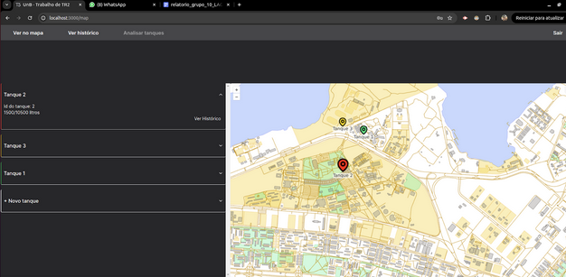
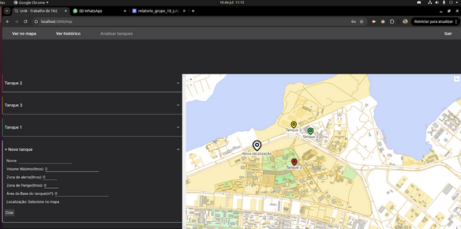
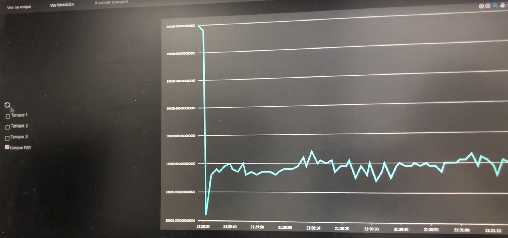

# Acompanhamento de Tanques de Combustível

Integrantes:

- Geraldo Teixeira do Nascimento Filho
- Lucas Corrêa Boaventura
- Artur Padovesi Piratelli

## Resultados

[Vídeo no youtube mostrando o projeto](https://www.youtube.com/watch?v=n60UQubpjDs)







## Estrutura do repositório

```
hw
└─ Pasta que contém código relacionado ao hardware (Arduíno)
web
└─ Pasta que contém código relacionado à apresentação dos dados no front.
BD
└─ Pasta que contém código relacionado ao banco de dados e uma REST API para interação.
```

## Comunicação LoRa

Não foi utilizado o padrão LoRaWAN por motivos de experimentação e aprendizado.

Implementação:

1. Tempo mínimo entre medições combinado entre gateway e nós. No intervalo entre uma medição e outra os aparelhos podem dormir;
2. Após o tempo combinado ter passado, a comunicação se inicia com um broadcast do gateway, seguido pelos dados enviados pelos nós;

Considerações:

- Frequência utilizada é de [915 MHz](https://www.thethingsnetwork.org/docs/lorawan/frequencies-by-country/#b)
- 8 (+ 4) _preamble symbols_ para comunicação normal;
- 30 (ou outro número aleatório mas pré definidio) de símbolos para o broadcast de polling;
- _implicit header mode_ poderia ser utilizado pois o tamanho dos pacotes é conhecido. Parece que a biblioteca utilizada possui um problema com o modo, no entanto. ([issue](https://github.com/sandeepmistry/arduino-LoRa/issues/532))
- CRC do hardware utilizado;
- _Downlink_ com _Inverted IQ_ pra evitar interferência
